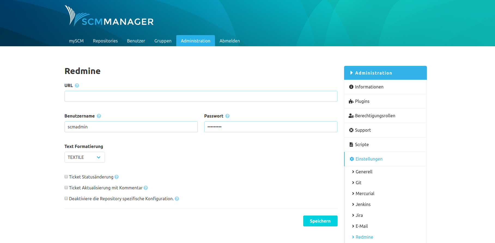

Wie im SCM-Manager 2 üblich, gibt es eine globale und eine repository-spezifische Konfiguration für das Redmine-Plugin. Die globale Konfiguration gilt für alle Repositories, die keine spezifische Konfiguration hinterlegt haben. Inhaltlich unterscheiden sich die Konfigurationen lediglich darin, dass in der globalen Konfiguration die repository-spezifische Konfiguration deaktiviert werden kann. 

### Konfigurationsformular
Für die Kommunikation zwischen dem SCM-Manager und Redmine muss zunächst zwingend die Redmine Instanz-URL inklusive Kontextpfad eingetragen werden. Zusätzlich werden auch noch Zugangsdaten benötigt, welche einem technischen Redmine Benutzer gehören sollten.
Anschließend lässt sich bereits konfigurieren in welcher Form Redmine Tickets verändert / ergänzt werden sollen. Es können dabei über Filter bestimmte Projekte oder die Rollensichtbarkeit eingeschränkt werden.

#### Ticket Status Aktualisierung
Über die "Status Modifizierungswörter" lassen sich Wörter definieren, die bei Ihrer Erwähnung in der Commit Nachricht zu einer Status Aktualisierung des Redmine Tickets führen.

#### Kommentare erzeugen
Die Kommentare werden am Redmine Ticket erzeugt, sobald innerhalb einer Commit Nachricht die Ticket-ID erwähnt wurde. Für die Kommentare lässt sich über ein Auswahl-Menü die Textformatierung einstellen.

Beispiel Commit Nachricht: "#492 user permissions bug done"

Damit wird ein Kommentar mit dieser Commit Nachricht am Redmine Ticket 492 erzeugt und dieses Ticket auf den Status "done" umgesetzt.

